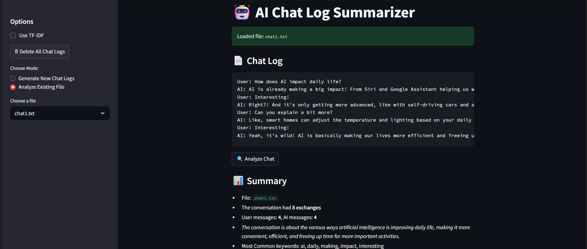

# 🤖 AI Chat Log Summarizer

This app generates short, verbal conversations between a user and an AI using the Groq API (LLaMA 3 model) and summarizes them with NLP techniques and LLM-powered context understanding.

🚀 **Live App**: [Click to open on Streamlit](https://al-ghalib-chat-log-summarizer-app-emvfaq.streamlit.app/)

---

## Preview



---


## Features

- **Short conversation generation** using LLaMA 3 (via Groq API)
- **Dynamic chat length** with casual user/AI replies
- **Conversation summarization** using:
  - Message statistics (user/AI counts)
  - Top keywords (frequency or TF-IDF)
  - LLM-generated "nature of conversation"
- **Log viewer** for past conversations
- **Delete all logs** with one click
- **Deployable on Streamlit Cloud**

---

## Project Structure

```
├── app.py                     # Streamlit UI app
├── main.py
├── chatlog_generator.py      # Handles Groq API chat creation
├── summarizer/
│   ├── __init__.py
│   ├── parser.py              # Parses chat logs
│   ├── statistics.py          # Counts message stats
│   ├── keywords.py            # Extracts keywords
│   └── summarizer.py          # Generates summaries & conversation nature
├── chat_logs/                 # Stores generated `.txt` logs
├── requirements.txt
├── .env.example               # Template for your Groq API key
└── README.md

````

---

## Installation

```bash
git clone https://github.com/al-ghalib/chat-log-summarizer.git
cd chat-log-summarizer
````
```bash
python -m venv venv
venv\Scripts\activate 
````
```bash
pip install -r requirements.txt
````

---

## Environment Variables

Create a `.env` file with your Groq API key:

```
GROQ_API_KEY=your_actual_groq_key
```

---

## Run Locally

```bash
streamlit run frontend_streamlit.py
```

---

## Deploy on Streamlit Cloud

1. Push this repo to GitHub
2. Go to [streamlit.io/cloud](https://streamlit.io/cloud) and connect your GitHub
3. Set `frontend_streamlit.py` as the main app file
4. Add your `GROQ_API_KEY` in the **Secrets** tab
5. Deploy!

---

## 🙋‍♂️ Contact

Built by [Abdullah Al Ghalib](https://www.linkedin.com/in/abdullah-al-ghalib/) — feel free to connect!
